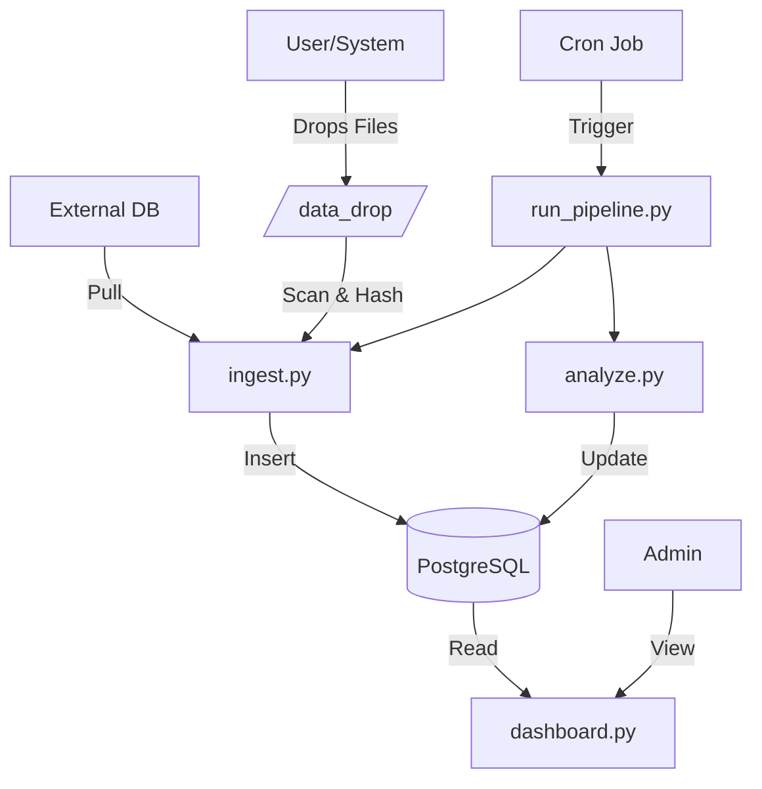

# Chat Analytics MVP

A batch-based chat analytics system that ingests Wati chat exports and external data, performs NLP analysis (sentiment, topics), and provides a Streamlit dashboard.

## Features
- **Unified Data Store**: Aggregates chats from generic `.txt` exports and external DBs.
- **Phone Identity**: Normalizes phone numbers to `91XXXXXXXXXX` format for unique tracking.
- **NLP Analysis**: Automated sentiment analysis and keyword-based topic modeling.
- **Batch Pipeline**: Idempotent processing with staleness alerts.
- **Dashboard**: Simple, responsive UI for monitoring KPIs and trends.

## Setup

1. **Prerequisites**: Python 3.9+, PostgreSQL (local or remote).
2. **Installation**:
   ```bash
   cd chat_analytics
   pip install -r requirements.txt
   ```
3. **Configuration**:
   Copy `.env` and fill in DB details:
   ```bash
   cp .env.template .env
   # Edit .env
   ```
4. **Initialize DB**:
   ```bash
   python db.py
   ```

## Usage

### Ingestion & Analysis Pipeline
Run this manually or schedule via Cron (e.g., every hour):
```bash
python run_pipeline.py
```
This script will:
1. Scan `data_drop/` for new `.txt` files.
2. Fetch new rows from `GLLITEDGE` source.
3. Run sentiment/topic analysis on new rows.
4. Send email alerts on failure or staleness.

### Dashboard
Launch the dashboard:
```bash
streamlit run dashboard.py
```

## Architecture



## Testing
Run the test suite with coverage:
```bash
pytest tests/ --cov=.
```
